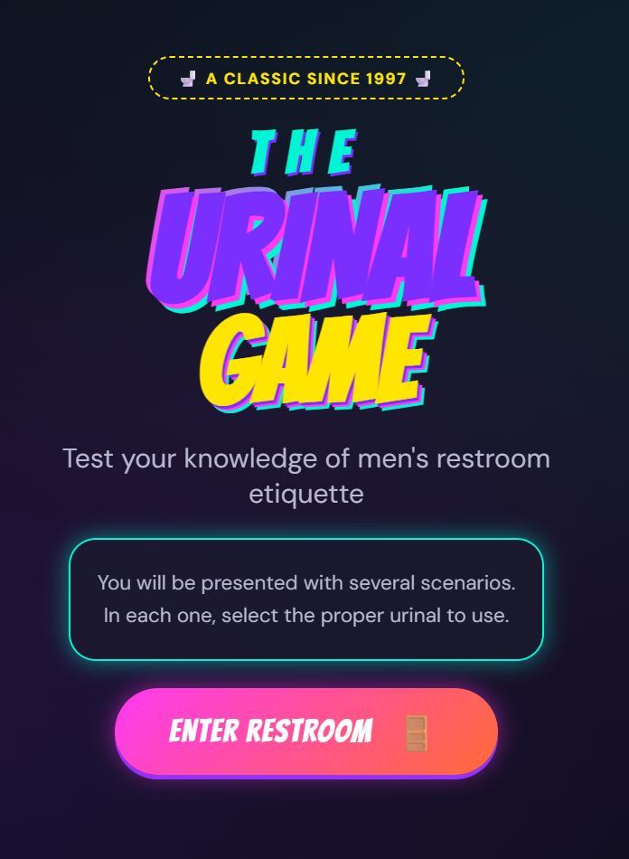

  

# The Urinal Game

**Solving humanity's most important optimization problem: which urinal to pick.**

A browser-based recreation of the [classic 1997 game](https://www.albinoblacksheep.com/games/urinal) by Gary Rosenzweig that tests your knowledge of the unwritten rules every man instinctively knows but was never formally taught.

## The Problem

Choosing a urinal isn't just a decision—it's a **social contract**. Pick wrong, and you've violated an ancient code of conduct passed down through generations of awkward silence.

## The Solution

Practice makes perfect. This game presents you with increasingly complex restroom scenarios and judges your choices with the cold, unforgiving logic of bathroom etiquette.

## How to Play

1. Open `index.html` in a browser
2. Click "Enter Restroom"
3. Survey the situation
4. Choose wisely 
5. Learn from your mistakes (or bask in your superiority)

## Rules You Already Know

- Maximize distance from other occupants
- End urinals are prime real estate
- When in doubt, use a stall
- Eye contact is not a feature, it's a bug

## Tech Stack

Pure HTML, CSS, and JavaScript. No frameworks. No build tools. Just like the restrooms of old—simple and functional.

## Credits

- **Original Game**: [Gary Rosenzweig](https://www.albinoblacksheep.com/games/urinal) (1997)
- **Design**: [DesignPrompts.dev](https://www.designprompts.dev/)

## License

MIT — because even bathroom etiquette should be open source.
